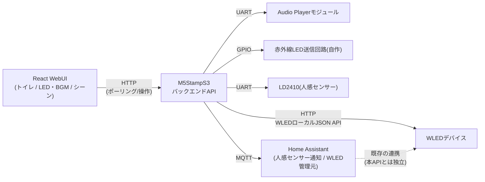

# WebUI バックエンド仕様

対応する本体仕様: [仕様.md](./仕様.md)
対応するフロントエンド仕様: トイレ自動化 Web UI 仕様書（React製、`src/`以下。現状はフロント単体のデモ実装）

## 改定について
フロントエンド仕様書の内容を踏まえて設計を全面的に見直した。主な変更点は以下の2つ。

1. **ウォシュレット詳細操作（洗浄スプレー/水勢/洗浄位置/便座温度/温水温度/脱臭/ノズル掃除/オート洗浄、流す大小ECOの区別）**
   現状「トイレ流し」IRコードが1種類しかなく未対応のため、拡張可能なIRコマンドテーブルとして設計する。今は「流す」相当の1件のみ実装済みとし、他は登録だけ行い実データ未収録の状態にする。IRコードを収集次第、コード変更なしにテーブルへ追加できる構成にする。
2. **LED（WLED）制御はマイコンからのみ行う**
   WLEDはHome Assistantに接続されているが、フロントエンドがHome Assistantへ直接アクセスすることはしない。フロントエンドはM5StampS3のAPIのみを呼び、LED操作はM5StampS3がWLED本体のローカルJSON APIへ転送する。これにより「シーン」（LED+BGM一括変更）もM5StampS3側で1リクエストとして完結できる。

## 目的
フロントエンド仕様書に定義された4カテゴリ（トイレ／LED／BGM／シーン）の操作と、人感センサー側の設定パラメータ（仕様.md）を、すべてM5StampS3が提供するHTTP APIから行えるようにする。またマイコンの現在状態をWebUIに表示するため、フロントエンドが状態を取得する仕組みを設ける。

対象外（本仕様書のスコープ外）:
- WebUI（HTML/JS）自体の実装
- 認証・認可（現状ローカルネットワーク内のみでの利用を前提とし、認証は設けない）
- Home Assistant⇔WLED間の連携設定自体（既存のHA側設定をそのまま利用する）
- 乾燥・フタ自動開閉（フロント仕様書側も明示的に未実装としているため対象外）

## 全体アーキテクチャ



- フロントエンドが直接やり取りするのはM5StampS3のみ。WLEDへの指示・状態取得はすべてM5StampS3が中継する
- Home AssistantとWLEDの連携（自動化・ダッシュボード等）は既存のまま独立して動作してよい。M5StampS3の制御経路とは別系統
- Home Assistant⇔M5StampS3間は既存のMQTT（人感センサー通知）のみで、LED制御には使わない

## 通信方式
- HTTP/1.1、JSON形式（Content-Type: application/json; charset=utf-8）
- マイコンをHTTPサーバーとして常時起動し、WiFi接続後に待ち受ける
- ポート: 80（デフォルト）
- 認証なし。同一LAN内からのアクセスのみを想定

## サーバー実装方針
- ライブラリ: ESPAsyncWebServer + AsyncTCP を推奨
  - 理由: loop()内には音声フェード（最大2000ms）等のブロッキング処理があり、同期WebServer（loop()内でhandleClient()）だとその間リクエスト処理が止まる。Async版はLWIPのコールバックで処理されるため、loop()側がブロッキング中でもHTTP応答自体は返せる
- JSON生成/パース: ArduinoJson
- WLEDへのリクエスト送信: `HTTPClient`（ブロッキング呼び出し）。同一LAN内・応答は数十〜数百ms程度のため許容するが、タイムアウトを短めに設定する（例: 1500ms）。WLED側の状態取得（GET）・反映（POST）はAPIハンドラ内で同期的に行ってよい
- ルーティングは`/api`プレフィックス配下に統一する

## データモデル

### roomState（人感センサー状態機械）
`"VACANT"` | `"ENTERING"` | `"STAYING"`（main.cppのenum RoomStateと対応）

### 人感センサー設定値（3項目、仕様.md対応）
| フィールド | 型 | 範囲 | 刻み | 説明 |
|---|---|---|---|---|
| sensitivity | number | 0-100 | 10 | 感度 |
| maxGate | number | 1-8 | 1 | ゲート（1ゲート=0.75m） |
| stayDurationSec | number | 5-60 | 5 | 滞在継続時間（秒） |

※このカテゴリはフロント仕様書の4カード（トイレ／LED・BGM／シーン）には登場しないが、仕様.mdの要件のため引き続きAPIとして提供する（保守・調整用。将来別画面から利用する想定）。

### トイレ（IRコマンドテーブル）
IRで送信する操作を「コマンドID」で抽象化する。1コマンド＝1つのIR RAWデータ配列（またはNEC等の標準プロトコルコード）に対応。

```cpp
struct IrCommand {
  const char* id;          // 例: "flush_large"
  const char* kind;        // "momentary" | "select" | "toggle" | "step" | "cycle"
  const uint16_t* rawData; // 未収録の場合はnullptr
  uint16_t rawLen;
};
```

| id | 対応UI | kind | 実装状況 |
|---|---|---|---|
| flush_large | 流す(大) ／ 自動流し(現行仕様) | momentary | 実装済み（既存の`kIrRawData`をそのまま割当） |
| flush_small | 流す(小) | momentary | 未実装（要収録） |
| flush_eco | 流す(ECO) | momentary | 未実装（要収録） |
| spray_off | 洗浄スプレー「止」 | select | 未実装 |
| spray_rear | 洗浄スプレー「おしり」 | select | 未実装 |
| spray_soft | 洗浄スプレー「やわらか」 | select | 未実装 |
| spray_bidet | 洗浄スプレー「ビデ」 | select | 未実装 |
| water_pressure_up | 水勢「強」 | step | 未実装 |
| water_pressure_down | 水勢「弱」 | step | 未実装 |
| nozzle_position_forward | 洗浄位置「前」 | step | 未実装 |
| nozzle_position_backward | 洗浄位置「後」 | step | 未実装 |
| seat_temp_cycle | 便座温度（低→中→高→低） | cycle | 未実装 |
| water_temp_cycle | 温水温度（低→中→高→低） | cycle | 未実装 |
| deodorizer_on / deodorizer_off | パワー脱臭 入/切 | toggle | 未実装 |
| nozzle_clean | ノズルそうじ | momentary | 未実装 |
| auto_clean_on / auto_clean_off | オート洗浄 入/切 | toggle | 未実装 |

**kindごとの意味と、実行時にバックエンドが更新する「追跡状態」（トイレはIR送信のみで実機からの状態読み出しができないため、ソフトウェア側で現在値を保持しUIに返す。物理リモコン操作や電源断で実機とズレる可能性がある点は既知の制約とする）:**
- `momentary`: 単発動作。追跡状態は変更しない（flush系・nozzle_clean）
- `select`: 選択式。追跡状態の該当フィールドを送信値に置き換える（spray系。「止」は`spray`を`"off"`にする）
- `toggle`: ON/OFF。対応するbool追跡状態を設定する
- `step`: 相対増減。追跡状態を1段階だけ増減し、範囲（水勢1-5、洗浄位置1-5）でクランプする
- `cycle`: 単一ボタンで循環。追跡状態を1段階進め、最大値の次は先頭に戻す（3段階）

追跡状態は`sensitivity`等と同様にNVSへ保存し、再起動後も直前の値を保持する。

### LED（WLED経由）
| フィールド | 型 | 範囲 | 説明 |
|---|---|---|---|
| on | boolean | - | 明るさ0%と等価（フロント仕様の「明るさ0%を消灯として扱う」に合わせる） |
| brightness | number | 0-100 | % |
| color | string | "#rrggbb" | 現在色 |
| presetId | string \| null | "warm" \| "neutral" \| "night" \| "pink" \| null | 直近に選択したプリセット。カスタムカラー適用後はnull |

プリセット⇔RGB対応表は本仕様書では未確定（要: 実際に使う色のRGB値をフロント側デザインと合わせて決定）。ファームウェア側の設定テーブルとして保持する。

### BGM（Audio Playerモジュール）
| フィールド | 型 | 説明 |
|---|---|---|
| playing | boolean | 再生中か |
| trackId | string | 現在（または最後に選択した）曲のID |
| elapsedSec | number | 概算の再生経過秒数（後述の制約あり） |
| durationSec | number | 曲の総再生時間（モジュールの`getTotalPlayTime()`から取得） |
| volume | number | 0-100 |
| repeat | string | "off" \| "one" \| "all" |
| shuffle | boolean | - |

曲一覧は全27曲（`SONGS`相当）をファームウェア側にハードコードし、SDカード上の実ファイル名と対応させる。モジュールにファイル一覧やメタデータ（曲名）を取得するAPIはないため、手動で対応表を保守する。曲名からアーティスト情報は取得できず、フロント側でも使用しないため`artist`フィールドは廃止した。

```cpp
struct BgmTrack {
  const char* id;
  const char* title;
  const char* fileName; // SDカード上のファイル名（playAudioByNameで使用）
};
```

**曲一覧（27曲、`title`は表示名兼SDカード上のファイル名から拡張子を除いたもの。同一曲名で番号違いの複数バリエーションを含むため、フラットな27件として扱う）:**

| id | title | fileName |
|---|---|---|
| 1 | At last I can breathe freely#1 | At last I can breathe freely#1.mp3 |
| 2 | At last I can breathe freely#2 | At last I can breathe freely#2.mp3 |
| 3 | At last I can breathe freely#3 | At last I can breathe freely#3.mp3 |
| 4 | At last I can breathe freely#4 | At last I can breathe freely#4.mp3 |
| 5 | At last I can breathe freely#5 | At last I can breathe freely#5.mp3 |
| 6 | At last I can breathe freely#6 | At last I can breathe freely#6.mp3 |
| 7 | At last I can breathe freely#7 | At last I can breathe freely#7.mp3 |
| 8 | At last I can breathe freely#8 | At last I can breathe freely#8.mp3 |
| 9 | The Forest Path#1 | The Forest Path#1.mp3 |
| 10 | The Forest Path#2 | The Forest Path#2.mp3 |
| 11 | The Forest Path#3 | The Forest Path#3.mp3 |
| 12 | The Forest Path#4 | The Forest Path#4.mp3 |
| 13 | The Forest Path#5 | The Forest Path#5.mp3 |
| 14 | The Forest Path#6 | The Forest Path#6.mp3 |
| 15 | The Forest Path#7 | The Forest Path#7.mp3 |
| 16 | The Forest Path#8 | The Forest Path#8.mp3 |
| 17 | The Forest Path#9 | The Forest Path#9.mp3 |
| 18 | The Forest Path#10 | The Forest Path#10.mp3 |
| 19 | The sky#1 | The sky#1.mp3 |
| 20 | The sky#2 | The sky#2.mp3 |
| 21 | The sky#3 | The sky#3.mp3 |
| 22 | The sky#4 | The sky#4.mp3 |
| 23 | The sky#5 | The sky#5.mp3 |
| 24 | The sky#6 | The sky#6.mp3 |
| 25 | Under water#1 | Under water#1.mp3 |
| 26 | Under water#2 | Under water#2.mp3 |
| 27 | Under water#3 | Under water#3.mp3 |

**repeat/shuffle → モジュールの`play_mode_t`へのマッピング（設計判断。ambient BGMとして常に何か鳴っている状態を基本とする）:**
| repeat | shuffle | play_mode_t |
|---|---|---|
| off | off | AUDIO_PLAYER_MODE_ALL_LOOP（曲リストを順番にループ） |
| one | off | AUDIO_PLAYER_MODE_SINGLE_LOOP |
| any | true | AUDIO_PLAYER_MODE_RANDOM（ディスク全体からランダム。SDカードにBGM用ファイル以外を置かない運用が前提） |

**制約:**
- モジュールには現在再生位置を取得するAPIがない。`elapsedSec`は再生開始/シーク時刻をファームウェア側で記録し`millis()`差分から算出する概算値（フロント仕様書が元々「実際の再生とは連動しないデモ値」としていたのと同様、厳密な同期はできない）
- シークは`playCurrentAudioAtTime(min, sec)`で実現可能

### シーン
| フィールド | 型 | 説明 |
|---|---|---|
| id | string | - |
| name | string | - |
| primary | boolean | true=常時カード表示、false=詳細内一覧 |
| led | object | `{ brightness, color }` |
| bgmTrackId | string | 実行時に選局し自動再生する曲ID |

初期5件（リラックス／集中／パーティ／おやすみ／来客、フロント仕様書のプリセットに対応、primaryはリラックス／集中／パーティ）をファームウェアに組み込み、ユーザー追加分はLittleFS上のJSONファイル（例: `/scenes.json`）に追記保存する（フロント仕様書の「保存（デモ）」を実データ永続化に置き換える）。編集・削除はフロント仕様書側も未実装のため、本APIでも提供しない（追加のみ）。

## エンドポイント一覧
| Method | Path | 用途 |
|---|---|---|
| GET | /api/status | 状態取得（ポーリング用、全カテゴリの要約） |
| GET | /api/settings | 人感センサー設定値取得 |
| PUT | /api/settings | 人感センサー設定値をライブ反映（NVS未保存） |
| POST | /api/settings/save | 人感センサー設定値をNVSへ保存（確定） |
| GET | /api/toilet/commands | トイレ操作コマンド一覧（実装状況含む） |
| POST | /api/toilet/commands/{id}/execute | トイレ操作コマンドを実行（IR送信） |
| GET | /api/toilet/state | トイレ操作の追跡状態取得 |
| GET | /api/led | LED状態取得（WLEDへ問い合わせて返す） |
| PUT | /api/led | LED状態を変更（WLEDへ転送） |
| GET | /api/bgm | BGM状態取得 |
| PUT | /api/bgm | BGM状態を変更（再生/一時停止/音量/選曲/シーク/リピート/シャッフル） |
| POST | /api/bgm/next | 次の曲 |
| POST | /api/bgm/previous | 前の曲 |
| GET | /api/bgm/tracks | 曲一覧取得 |
| GET | /api/scenes | シーン一覧取得 |
| POST | /api/scenes/{id}/execute | シーン実行（LED+BGMを一括変更） |
| POST | /api/scenes | シーン新規作成（永続化） |

## エンドポイント詳細

### GET /api/status
既存の`printStatus()`相当に加え、トイレ/LED/BGMの要約を含めた集約状態。フロントエンドの主ポーリング対象。

```json
{
  "roomState": "STAYING",
  "presence": { "raw": true, "smoothed": true },
  "toilet": { "spray": "off", "waterPressure": 3, "nozzlePosition": 3, "seatTemp": 1, "waterTemp": 1, "deodorizer": false, "autoClean": true },
  "led": { "on": true, "brightness": 60, "color": "#ffcf8a", "presetId": "warm" },
  "bgm": { "playing": true, "trackId": "2", "elapsedSec": 42, "durationSec": 190, "volume": 30, "repeat": "off", "shuffle": false },
  "settings": { "sensitivity": 20, "maxGate": 1, "stayDurationSec": 20 },
  "wifi": { "connected": true, "ip": "192.168.11.42" },
  "mqtt": { "enabled": false, "connected": false },
  "wled": { "reachable": true },
  "uptimeMs": 123456
}
```
`led`は毎回WLEDへ問い合わせるとポーリング頻度分の負荷になるため、直近取得値をキャッシュし数秒に1回だけ実機へ再取得する運用を想定（キャッシュ間隔は実装時に調整）。

### GET/PUT /api/settings, POST /api/settings/save
既存仕様のまま（変更なし）。

- `PUT /api/settings`: 一部のみ指定可。範囲・刻み条件を満たさない場合400、all-or-nothingで適用
- `POST /api/settings/save`: 現在のライブ値をNVSへ保存

### GET /api/toilet/commands
```json
{
  "commands": [
    { "id": "flush_large", "kind": "momentary", "implemented": true },
    { "id": "flush_small", "kind": "momentary", "implemented": false },
    { "id": "spray_rear", "kind": "select", "implemented": false }
  ]
}
```

### POST /api/toilet/commands/{id}/execute
リクエストボディなし。IR送信し、kindに応じて追跡状態を更新する。

Response 200:
```json
{ "id": "water_pressure_up", "state": { "waterPressure": 4 } }
```
Response 404: 未定義のid
Response 501: id は定義済みだがIR RAWデータ未収録（`implemented:false`）

**連続実行の間引き（kind別の最小間隔）:**
| kind | 最小間隔 | 理由 |
|---|---|---|
| momentary（flush系） | 2000ms | 誤連打による重複送信を防ぐ |
| momentary（nozzle_clean） | 2000ms | 同上 |
| step / cycle | 150ms | 水勢等を素早く連打して目的の段階まで動かす操作性を優先 |
| select / toggle | 300ms | 誤連打防止と体感速度のバランス |

間隔内の再リクエストは409（`{"error":{"code":"cooldown", ...}}`）。

### GET /api/toilet/state
```json
{ "spray": "off", "waterPressure": 3, "nozzlePosition": 3, "seatTemp": 1, "waterTemp": 1, "deodorizer": false, "autoClean": true }
```

### GET /api/led
M5StampS3がWLEDのローカルJSON API（`GET /json/state`）へ問い合わせて整形する。

Response 200:
```json
{ "on": true, "brightness": 60, "color": "#ffcf8a", "presetId": "warm" }
```
Response 502（WLED応答なし）:
```json
{ "error": { "code": "wled_unreachable", "message": "WLED did not respond within 1500ms" } }
```

### PUT /api/led
Request body（一部のみ可）:
```json
{ "brightness": 60, "presetId": "warm" }
```
```json
{ "color": "#ff66aa" }
```
挙動:
- `presetId`指定時はファームウェア内のプリセット⇔RGB対応表から色を決定する
- `color`指定時はそのままRGBとして扱い、`presetId`は`null`にする
- `brightness`を0にした場合は`on:false`としてWLEDへ送る（明るさ0%=消灯という仕様に合わせる）
- M5StampS3はWLEDの`POST /json/state`へ`{"on":..,"bri":..,"seg":[{"col":[[r,g,b]]}]}`相当を転送する

Response 200: 反映後の状態（GET /api/ledと同形式）
Response 502: WLEDへの転送失敗

### GET/PUT /api/bgm
```json
{ "playing": true, "trackId": "2", "elapsedSec": 42, "durationSec": 190, "volume": 30, "repeat": "off", "shuffle": false }
```
`PUT`は一部のみ指定可。`action: "play" | "pause"`、`volume`、`trackId`（選局＋自動再生開始）、`seekSec`、`repeat`、`shuffle`をそれぞれ独立に更新できる。

### POST /api/bgm/next, POST /api/bgm/previous
リクエストボディなし。応答は更新後のBGM状態（GET /api/bgmと同形式）。

### GET /api/bgm/tracks
```json
{ "tracks": [ { "id": "1", "title": "At last I can breathe freely#1", "fileName": "At last I can breathe freely#1.mp3" } ] }
```
全27件を返す（一覧は「データモデル > BGM（Audio Playerモジュール）」の表を参照）。

### GET /api/scenes
```json
{
  "scenes": [
    { "id": "relax", "name": "リラックス", "primary": true, "led": { "brightness": 40, "color": "#ffcf8a" }, "bgmTrackId": "1" },
    { "id": "sleep", "name": "おやすみ", "primary": false, "led": { "brightness": 10, "color": "#ff8a8a" }, "bgmTrackId": "3" }
  ]
}
```

### POST /api/scenes/{id}/execute
リクエストボディなし。LEDへの反映（WLED転送）とBGMの選局・再生開始を順に実行する。片方が失敗した場合でも他方は実行済みのまま返す（部分成功を許容し、エラー内容に失敗した対象を含める）。

Response 200:
```json
{ "led": { "on": true, "brightness": 40, "color": "#ffcf8a", "presetId": null }, "bgm": { "playing": true, "trackId": "1", ... } }
```
Response 207相当（部分失敗。実装簡略化のため200+ペイロード内に`ledError`を含める形でもよい）:
```json
{ "led": null, "ledError": { "code": "wled_unreachable" }, "bgm": { "playing": true, "trackId": "1", ... } }
```

### POST /api/scenes
```json
{ "name": "映画", "led": { "brightness": 20, "color": "#4444ff" }, "bgmTrackId": "4" }
```
LittleFS上の`/scenes.json`に追記して永続化する。`primary`は常に`false`（詳細内一覧に追加）。

Response 201: 作成されたシーン（idはサーバー側で採番）

## エラーレスポンス共通形式
```json
{ "error": { "code": "string", "message": "string" } }
```
| HTTPステータス | code | 発生条件 |
|---|---|---|
| 400 | invalid_parameter | パラメータが範囲・刻み条件を満たさない / JSONパース失敗 |
| 404 | not_found | 未定義パス / 未定義のコマンドid・トラックid・シーンid |
| 405 | method_not_allowed | 未対応メソッド |
| 409 | cooldown | 連続実行の間引き（/api/toilet/commands/{id}/execute） |
| 501 | not_implemented | IRコマンドは定義済みだがRAWデータ未収録 |
| 502 | wled_unreachable | WLEDへの転送・問い合わせに失敗 |

## 状態監視の仕組み（フロントエンドのポーリング）
- フロントエンドは一定間隔（推奨: 1000ms）で`GET /api/status`を呼び、4カード全体の表示を更新する
- WebSocket/SSEではなくポーリングを採用する理由:
  - ESP32側の実装・接続管理コストが小さい（コネクション維持が不要）
  - 状態変化はおおむね数秒単位のイベントであり、リアルタイム性への要求が低い
  - フロント側の実装もシンプル（`setInterval` + `fetch`）にできる
- 将来的により即時性が必要になった場合は、ESPAsyncWebServerの`AsyncEventSource`（SSE）への切り替えが可能

## 実装上の注意（main.cppとの接続点）
- グローバル変数（設定値・roomState・トイレ追跡状態・BGM状態等）をHTTPハンドラから直接参照/更新する。ESP32はシングルコアのFreeRTOSタスクとして動作するため大きな競合は起きにくいが、複数フィールドにまたがる更新はatomicではない点に留意する
- loop()内のブロッキング処理（`fadeVolume`: 最大2000ms、`delay(20)`等）がある間はセンサー更新・状態遷移が止まるため、その間ポーリングしても値は変化しない（既存動作を維持するだけで、本API追加による新規の問題ではない）
- WLEDへの`HTTPClient`呼び出しはブロッキングだが、同一LAN内・短タイムアウト（1500ms程度）に抑えれば実用上問題にならない想定。タイムアウト・接続失敗時は502を返し、それ以上リトライしない（フロント側の再ポーリングに任せる）
- WiFi接続は現状`ENABLE_MQTT=false`の場合接続しない設定になっている。WebUI・WLED連携を使うには`ENABLE_MQTT`の値に関わらずWiFiへ接続する必要があるため、`setup()`側の接続条件を見直す必要がある（実装時に対応要）
- IRコマンドテーブル・BGM曲テーブル・LEDプリセット対応表はPROGMEM上の静的配列として保持し、コード変更のみで追加・修正できるようにする
- シーン永続化（`/scenes.json`）にはLittleFSの初期化（`setup()`内で`LittleFS.begin()`）が必要

## 未確定・要検討事項
- ウォシュレット詳細操作の実IRコード収集（現状「流す(大)」相当以外すべて未収録）
- LEDプリセット4色（電球色／昼白色／常夜灯／ピンク）の具体的なRGB値
- WLEDのIPアドレス（固定IP運用を推奨。DHCPの場合はmDNS等での名前解決を検討）
- シーンのLED色・曲の初期5件（リラックス／集中／パーティ／おやすみ／来客）の具体的な設定値
- WebUI（フロントエンド）の静的ファイル配信方法（SPIFFS/LittleFSに置くか、別サーバーから配信しCORSで許可するか）
