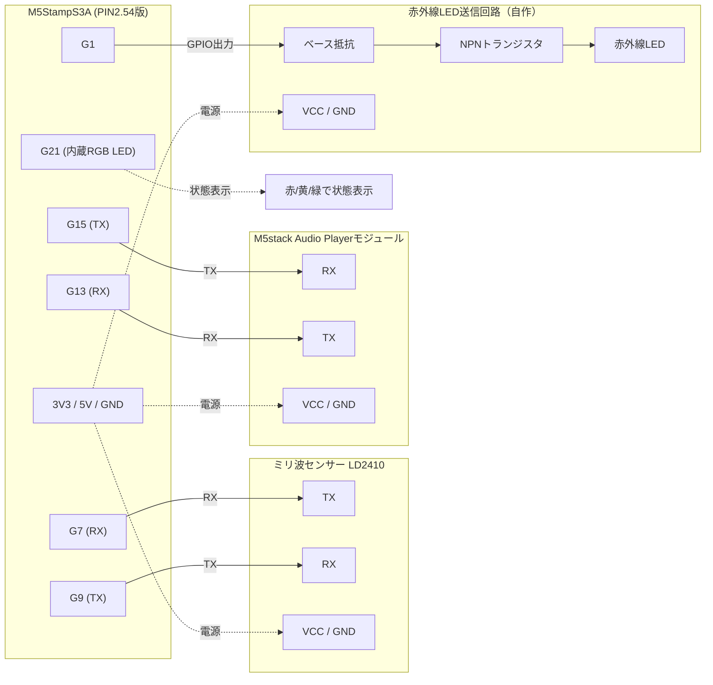

# タイトル

## 使用端末
1. M5StampS3A（LCD・物理ボタンなし。RGB LED内蔵）
1. ミリ波センサー LD2410
1. M5stack Audio Playerモジュール
1. 赤外線LED送信回路（自作：赤外線LED＋トランジスタ。M5stack IR REMOTEモジュールは使用しない）

## ハードウェア接続
本体：M5StampS3A
LCD：搭載しないため使用しない
本体スピーカー：使用しない（オフ）
状態表示：M5StampS3A内蔵RGB LED（G21固定・本体標準機能のため変更不可）で代替
　※StampS3Aでは無印StampS3と異なり、RGB LEDへの給電が予備LCD用FPCバスのバックライト系統と
　多重化されている(M5Stack公式のハードウェア更新情報より)。GPIO21によるデータ制御自体は
　従来同様だが、給電経路が変わっているため実機で点灯するか要確認(未検証。点灯しない場合は
　StampS3Aの回路図でLED/バックライト系統の有効化に追加のGPIO操作が必要か確認すること)
M5StampS3A（TX=G9/RX=G7、左列） ⇒ ミリ波センサー LD2410（UART接続）
M5StampS3A（TX=G15/RX=G13、左列下部） ⇒ M5stack Audio Playerモジュール（UART接続）
　※当初G3/G5に割り当てていたが、StampS3A移行後にAudio Playerから応答が一切返らない
　症状が発生。モジュール本体は別途正常と切り分け済みのため、このヘッダ個体ではG3/G5経由の
　配線が機能しないと判断し、未使用だったG13/G15(元はI2C用SDA/SCLラベル。本プロジェクトでは
　I2C自体を使用しないため単純GPIOとして転用)へ変更した
M5StampS3A（G1、送信専用） ⇒ 赤外線LED送信回路
　赤外線LED送信回路：赤外線LED＋NPNトランジスタの自作回路（トランジスタでLED電流を増幅駆動する）。赤外線受信は使用しない
　G1からベース抵抗を介してトランジスタのベースを駆動し、コレクタ側でIR LEDを点灯させる構成とする（RMT等でのIR送信に対応するためGPIO直接駆動）
各モジュールの電源：StampS3Aヘッダ上の3V3（右列上部）／5V（左列下部）／GND（左列・右列に各1箇所）から、モジュールの動作電圧仕様に応じて供給する
制御方法：別途立ち上げるWebサーバーのAPI経由で操作する

### ピン選定の理由（無印M5StampS3 PIN2.54版の実機ラベルで確認した配置。StampS3A移行時の再確認が必要）
以下は無印StampS3 PIN2.54版で実機確認した内容。StampS3AもGPIO一覧・パッケージサイズ(26×18mm)・
23ピンという仕様は同一だが、ヘッダの物理配置図はM5Stack公式サイトが画像のみで公開しており
本書作成時点ではテキストで再確認できていない。配線前に実機のシルク印刷と本表を必ず突き合わせること。
・左列9P（上から下）：G1, G3, G5, G7, G9, GND, 5V, G13(SDA), G15(SCL)
・右列9P（上から下）：3V3, G43(U0Tx), G44(U0Rx), EN, G0, …, GND（G21はRGB LED専用、ヘッダには汎用ピンとして出ていない）
・前面6P：LCD/Ext.用の予備ピン（本プロジェクトでは未使用）
1.27mmピッチ23ピン版と異なり、2.54mmピッチ版の左列は奇数番号のGPIO（G1, G3, G5, G7, G9）のみが露出しており、G2/G4/G6/G8は使用不可
G0は本体ボタン兼ダウンロードモード切替ピンのため未使用（出力用途では誤動作の恐れがあるため避ける）
G21は内蔵RGB LEDの固定ピンのため他用途では使用しない
G19/G20はUSBネイティブ（D+/D-）専用のためヘッダに出ておらず使用不可
**G43(U0Tx)/G44(U0Rx)は使用しない**：シルク印刷上は「UART」表記だが、実機検証の結果、この2ピンはESP-IDFのシステムコンソールUART(UART0)がデフォルトで固定的に使用しており(ビルド設定 `CONFIG_ESP_CONSOLE_UART_NUM=0`)、Arduino側の`Serial`をUSB CDCへ切り替えても競合が解消されず、ジャンパ線での直結ループバックすら成立しなかった（詳細は実装時の動作確認で判明）。そのため当初の想定を変更し、LD2410は残りの奇数GPIOであるG7/G9に割り当てた
上記を踏まえ、露出している奇数GPIOのうちG1を赤外線LED送信用GPIO、G7/G9をLD2410に割り当てた。
Audio Playerモジュールは当初G3/G5を割り当てていたが、StampS3Aで応答が返らない問題が発生したため
G13/G15に変更した（詳細は上記「ハードウェア接続」参照）。G3/G5自体が全く使用不可と確定した
わけではなく、この個体でのみ再現した可能性も残るため、余裕があれば別個体での再検証が望ましい

### 配線図

## 画面
LCD非搭載のため画面表示は行わない
状態（入室/滞在/退室）に応じた表示はM5StampS3A内蔵RGB LEDの色で代替する（対応する色は「遷移時の処理」参照）

## 操作
本体ボタン(G0)：押下でトイレ流し(赤外線送信)を手動実行する
設定パラメータの調整は物理ボタンでは行わず、別途立ち上げるWebサーバーのAPI経由で操作する（API仕様は別途定義。本仕様書では対象外）

## 設定パラメータ
API経由で調整できるパラメータは以下の3つ
・感度（sensitivity）：0〜100（10刻み）　※初期値はコード内定数
・ゲート（maxGate）：1〜8（1刻み）　※初期値はコード内定数
・滞在継続時間（入室状態→滞在状態の継続時間）：5〜60秒（5刻み）　※初期値20秒
値の変更はAPI経由で即座にセンサー・状態判定へ反映される（ライブ調整）
API経由の確定操作をトリガーに3項目まとめてNVS（不揮発メモリ）に保存する
起動時はNVSに保存された値があれば読み込み、なければ上記初期値を使用する

## シリアルモニタ
各状態を出力

## 実現したいこと
ミリ波センサー（LD2410）でトイレに人がいるかを判定したい
入室と退室で処理を分ける

## 人検知ロジック
距離の閾値判定は行わず、LD2410センサーが持つ「人がいるか（presence detected）」の判定結果をそのまま使用する
感度（sensitivity）・検知最大距離（ゲート数）は初期値をコード内定数として持ち、設定パラメータ（「設定パラメータ」参照）からAPI経由で実行中に調整・NVS保存が可能
・感度：0〜100（値が大きいほど検知しやすい）
・ゲート：1〜8（1ゲート＝0.75m、検知したい最大距離に応じて設定）
センサーの使い方は下記を参考にする
C:\Users\s\OneDrive\ドキュメント\PlatformIO\Projects\miriha\src\main.cpp

## 音声再生ロジック
M5stack Audio Playerモジュールのみを使用する（本体スピーカーはオフ）
M5stack Audio PlayerモジュールにあるSDカード内の音声ファイル(mori.mp3)を使用する
常に再生する（再生開始と停止は音量で表現する）
ファイルの最後まで再生したらまた最初から再生を開始する
再生開始・停止は音量でフェードする（フェード時間2000ms）

## 赤外線送信ロジック
M5stack IR REMOTEモジュールは使用せず、赤外線LED＋トランジスタによる自作回路をGPIO（送信専用）で駆動してIR送信を行う
送信するRAWデータは既存のものをそのまま使用する

#### 流す「大」（flush_large）
static const uint16_t kIrRawData[] = {6010, 2972, 602, 548, 548, 1696, 550, 574, 548, 548, 574, 548, 574, 546, 574, 546, 548, 574, 546, 574, 546, 574, 546, 570, 550, 1668, 576, 570, 550, 568, 526, 596, 524, 596, 524, 596, 524, 570, 550, 570, 552, 566, 550, 568, 524, 594, 526, 596, 524, 1694, 548, 572, 550, 1670, 574, 1670, 550, 598, 526, 596, 524, 572, 550, 572, 550, 1670, 548, 596, 526, 1696, 548, 1672, 574, 572, 550, 572, 550, 570, 526, 594, 526, 37380, 5984, 3000, 576, 570, 552, 1670, 548, 598, 524, 596, 524, 596, 524, 570, 552, 570, 550, 568, 550, 570, 524, 596, 522, 596, 524, 1694, 548, 570, 552, 570, 550, 570, 552, 568, 524, 596, 524, 596, 524, 596, 524, 568, 550, 568, 550, 570, 550, 568, 524, 1694, 546, 596, 524, 1670, 574, 1672, 574, 572, 526, 596, 524, 598, 524, 596, 524, 1692, 552, 570, 552, 1694, 526, 1720, 526, 596, 526, 570, 550, 570, 552, 570, 552};
static const uint16_t kIrRawLen = 163;

#### 流す「小」（flush_small）
static const uint16_t kIrRawData[] = {6012, 2972, 602, 548, 548, 1696, 550, 574, 548, 548, 574, 548, 572, 548, 574, 548, 548, 572, 548, 574, 546, 574, 546, 570, 550, 1668, 574, 570, 552, 568, 526, 596, 524, 596, 524, 596, 522, 570, 550, 570, 550, 570, 550, 570, 524, 594, 526, 596, 524, 1694, 548, 570, 550, 570, 550, 570, 550, 1668, 550, 596, 524, 596, 524, 570, 550, 1670, 574, 570, 524, 596, 526, 596, 524, 1696, 548, 570, 550, 570, 550, 572, 550, 39604, 5982, 2998, 576, 572, 550, 1670, 548, 598, 524, 598, 524, 596, 526, 568, 550, 570, 552, 568, 550, 568, 524, 596, 522, 596, 524, 1694, 550, 570, 552, 570, 552, 570, 550, 570, 524, 596, 524, 596, 524, 596, 524, 570, 550, 568, 552, 568, 550, 570, 524, 1694, 548, 596, 524, 596, 524, 570, 550, 1668, 574, 570, 526, 596, 524, 596, 524, 1670, 574, 570, 552, 568, 552, 570, 550, 1670, 546, 598, 524, 596, 524, 570, 550, 39492, 5984, 2998, 576, 570, 552, 1670, 548, 598, 526, 596, 524, 570, 552, 570, 552, 570, 550, 568, 550, 570, 524, 596, 522, 596, 524, 1668, 576, 570, 552, 568, 552, 570, 524, 596, 524, 596, 524, 598, 524, 596, 524, 570, 550, 568, 550, 568, 550, 570, 524, 1694, 546, 596, 524, 570, 550, 570, 552, 1668, 548, 596, 526, 596, 524, 596, 522, 1672, 574, 570, 552, 570, 552, 570, 524, 1696, 548, 596, 524, 570, 552, 570, 550};
static const uint16_t kIrRawLen = 245;

#### 流す「ECO」（flush_eco）
static const uint16_t kIrRawData[] = {5960, 2972, 576, 574, 548, 1670, 576, 550, 572, 548, 574, 548, 548, 574, 548, 572, 548, 574, 546, 574, 548, 570, 550, 548, 570, 1668, 548, 596, 526, 574, 548, 596, 524, 570, 550, 568, 550, 570, 548, 570, 524, 596, 524, 596, 524, 594, 524, 596, 524, 1668, 574, 572, 550, 1670, 548, 1696, 550, 570, 552, 1672, 574, 1672, 550, 598, 526, 1698, 550, 572, 552, 1672, 574, 1674, 548, 598, 524, 1672, 576, 1672, 574, 572, 550, 32900, 5956, 2970, 576, 596, 524, 1670, 574, 572, 550, 572, 550, 570, 524, 596, 524, 594, 526, 596, 524, 570, 550, 570, 548, 570, 550, 1668, 548, 596, 524, 596, 526, 596, 524, 570, 550, 570,548, 570, 550, 570, 522, 596, 524, 594, 524, 594, 526, 568, 550, 1668, 572, 570, 550, 1668, 548, 1720, 526, 572, 550, 1672, 572, 1696, 526, 596, 526, 1720, 526, 570, 552, 1694, 550, 1696, 524, 596, 526, 1696, 552, 1694, 552, 572, 524, 32848, 5954, 2970, 576, 596, 524, 1670, 574, 572, 550, 570, 550, 570, 524, 596, 524, 594, 526, 596, 524, 570, 550, 570, 550, 570, 550, 1668, 548, 596, 526, 594, 526, 570, 552, 568, 550, 570, 550, 570, 550, 570, 524, 596, 524, 596, 524, 594, 524, 570, 550, 1668, 572, 570, 524, 1720, 526, 1720, 526, 570, 552, 1694, 552, 1696, 526, 596, 526, 1694, 552, 570, 552, 1696, 524, 1722, 524, 598, 526, 1696, 554, 1696, 552, 572, 524};
static const uint16_t kIrRawLen = 245;

#### 洗浄スプレー「止」（spray_off）
static const uint16_t kIrRawData[] = {5956, 2972, 576, 574, 548, 1670, 574, 572, 550, 548, 572, 548, 548, 574, 546, 572, 548, 572, 548, 570, 550, 570, 550, 548, 570, 1668, 548, 596, 524, 600, 522, 570, 550, 1668, 574, 570, 550, 1670, 550, 596, 524, 1672, 574, 572, 550, 1670, 550, 596, 524, 1698, 550, 1672, 574, 572, 552, 1670, 548, 1698, 548, 598, 526, 1672, 574, 572, 552, 570, 524, 1696, 550, 1696, 550, 1672, 574, 572, 552, 570, 524, 598, 524, 596, 524, 30668, 5952, 2970, 576, 596, 526, 1668, 574, 572, 550, 570, 550, 570, 524, 596, 524, 594, 524, 596, 524, 596, 524, 570, 550, 572, 546, 1668, 546, 596, 524, 596, 526, 596, 524, 1692, 550, 572, 550, 1670, 548, 598, 524, 1720, 524, 570, 552, 1670, 574, 570, 524, 1698, 548, 1672, 574, 570, 552, 1672, 574, 1672, 548, 596, 526, 1670, 574, 572, 550, 572, 550, 1672, 546, 1720, 526, 1670, 576, 572, 550, 572, 550, 570, 524, 596, 524, 30592, 5954, 2970, 576, 596, 524, 1670, 574, 572, 550, 570, 550, 570, 524, 596, 524, 594, 526, 596, 524, 570, 550, 570, 550, 570, 548, 1668, 548, 596, 526, 594, 526, 598, 520, 1670, 572, 572, 550, 1670, 548, 596, 526, 1670, 574, 572, 550, 1694, 550, 572, 524, 1698, 548, 1694, 552, 570, 550, 1672, 546, 1722, 526, 596, 526, 1694, 578, 544, 552, 570, 550, 1694, 526, 1720, 526, 1694, 552, 572, 550, 572, 524, 598, 524, 596, 524, 33500, 5952, 2970, 574, 596, 524, 1670, 574, 570, 550, 572, 550, 570, 524, 596, 524, 596, 524, 596, 524, 568, 552, 568, 548, 570, 548, 1670, 546, 596, 524, 596, 526, 594, 524, 570, 550, 570, 550, 570, 550, 570, 524, 596, 524, 596, 524, 594, 526, 568, 550, 568, 550, 568, 550, 570, 548, 568, 522, 596, 524, 594, 524, 594, 526, 568, 550, 568, 550, 570, 548, 570, 522, 594, 524, 596, 524, 594, 524, 594, 526, 568, 550, 44094, 5954, 2970, 576, 598, 524, 1696, 548, 572, 550, 572, 550, 572, 550, 570, 524, 596, 524, 596, 524, 596, 524, 546, 572, 570, 548, 1668, 548, 598, 526, 592, 526, 596, 524, 596, 524, 570, 550, 570, 548, 570, 550, 570, 524, 596, 524, 594, 524, 596, 524, 568, 550, 570, 548, 570, 550, 570, 550, 570, 524, 594, 524, 594, 524, 594, 524, 568, 550, 570, 548, 570, 550, 568, 524, 596, 522, 594, 524, 594, 524, 568, 550, 44060, 5954, 2972, 576, 572, 548, 1720, 524, 572, 550, 572, 550, 570, 550, 570, 524, 594, 526, 596, 526, 594, 524, 570, 550, 570, 548, 1668, 548, 596, 526, 594, 526, 596, 524, 596, 524, 570, 550, 570, 548, 570, 550, 570, 524, 594, 524, 594, 524, 594, 524, 570, 550, 568, 548, 570, 548, 570, 550, 568, 524, 594, 524, 594, 524, 594, 524, 568, 550, 568, 548, 570, 548, 570, 522, 594, 524, 594, 524, 594, 526, 568, 550};
static const uint16_t kIrRawLen = 491;

#### 洗浄スプレー「おしり」（spray_rear）
static const uint16_t kIrRawData[] = {5956, 2970, 576, 572, 548, 1694, 550, 548, 572, 548, 574, 548, 572, 548, 548, 572, 546, 574, 546, 574, 546, 546, 574, 546, 570, 1668, 574, 548, 546, 574, 546, 574, 546, 596, 524, 570, 550, 570, 548, 570, 550, 568, 524, 594, 524, 594, 524, 596, 522, 596, 524, 1666, 574, 1668, 548, 598, 524, 594, 526, 596, 524, 570, 550, 570, 550, 570, 550, 1668, 548, 1694, 550, 572, 548, 572, 550, 570, 550, 570, 550, 570, 524, 39650, 5952, 2968, 576, 596, 524, 1696, 548, 570, 550, 572, 550, 570, 550, 570, 524, 594, 526, 596, 524, 594, 524, 570, 548, 570, 548, 1666, 574, 570, 524, 596, 524, 596, 524, 596, 524, 570, 548, 570, 548, 570, 548, 570, 524, 594, 524, 594, 522, 594, 524, 594, 524, 1666, 572, 1670, 548, 596, 524, 596, 524, 596, 526, 570, 548, 570, 548, 570, 548, 1668, 546, 1696, 548, 596, 524, 570, 550, 570, 550, 570, 550, 570, 522, 39538, 5954, 2970, 576, 596, 524, 1668, 576, 570, 550, 572, 550, 548, 572, 546, 548, 596, 524, 596, 524, 594, 524, 570, 548, 570, 548, 1668, 548, 596, 524, 594, 524, 596, 524, 596, 524, 570, 550, 570, 548, 568, 550, 568, 524, 594, 524, 594, 524, 594, 524, 568, 550, 1666, 574, 1668, 548, 596, 526, 594, 526, 596, 524, 570, 550, 570, 550, 570, 548, 1668, 546, 1694, 548, 570, 550, 570, 550, 570, 548, 570, 550, 570, 524, 42546, 5950, 2968, 576, 568, 550, 1670, 574, 570, 524, 598, 524, 596, 524, 596, 524, 594, 524, 568, 550, 570, 550, 568, 550, 568, 522, 1694, 548, 596, 524, 570, 550, 570, 550, 570, 550, 570, 550, 1668, 548, 596, 524, 1668, 576, 1670, 574, 572, 524, 598, 524, 1694, 548, 570, 550, 546, 576, 570, 550, 570, 550, 570, 522, 596, 522, 596, 522, 1668, 574, 568, 550, 1694, 524, 596, 524, 1694, 548, 1694, 552, 570, 552, 570, 552, 35096, 5950, 2968, 576, 596, 524, 1670, 574, 572, 548, 570, 550, 570, 550, 568, 524, 594, 524, 596, 524, 572, 546, 570, 548, 570, 548, 1666, 548, 574, 546, 594, 526, 572, 546, 596, 524, 570, 548, 1666, 574, 570, 524, 1692, 550, 1670, 574, 572, 550, 572, 550, 1670, 548, 596, 524, 596, 524, 596, 524, 570, 550, 568, 548, 570, 550, 570, 524, 1692, 548, 596, 524, 1692, 550, 570, 550, 1694, 524, 1720, 526, 596, 524, 570, 550, 35066, 5950, 2966, 576, 596, 524, 1696, 548, 572, 548, 570, 550, 570, 550, 568, 524, 594, 526, 596, 524, 594, 524, 570, 548, 570, 546, 1666, 574, 570, 524, 594, 526, 596, 524, 596, 524, 570, 548, 1666, 572, 570, 524, 1694, 548, 1696, 548, 572, 550, 572, 550, 1670, 548, 596, 524, 596, 526, 596, 524, 570, 550, 570, 548, 570, 550, 570, 522, 1716, 526, 594, 524, 1692, 550, 570, 550, 1692, 524, 1720, 524, 596, 524, 570, 550};
static const uint16_t kIrRawLen = 491;

#### 洗浄スプレー「柔らか」（spray_soft）
static const uint16_t kIrRawData[] = {6002, 2994, 550, 572, 548, 1668, 574, 548, 572, 548, 574, 546, 574, 544, 548, 572, 548, 572, 546, 572, 546, 548, 570, 548, 572, 1664, 548, 596, 524, 572, 548, 594, 524, 594, 524, 570, 548, 570, 548, 568, 550, 568, 522, 594, 524, 592, 526, 594, 524, 568, 550, 1666, 572, 1668, 548, 596,524, 596, 524, 596, 524, 570, 548, 570, 548, 570, 550, 1666, 548, 1694, 548, 570, 550, 570, 550, 570, 548, 570, 550, 568, 524, 39570, 6002, 2994, 550, 596, 524, 1668, 574, 572, 550, 570, 550, 570, 524, 572, 548, 594, 524, 594, 524, 570, 548, 568, 548, 546, 574, 1664, 548, 596, 524, 596, 524, 596, 524, 568, 548, 570, 548, 570, 548, 568, 522, 594, 524, 592, 524, 594, 524, 594, 524, 568, 548, 1666, 574, 1668, 548, 594, 526, 596, 524, 570, 550, 568, 548, 570, 548, 570, 522, 1692, 548, 1694, 548, 570, 550, 572, 548, 570, 550, 570, 524, 594, 524, 39502, 5974, 2994, 576, 570, 550, 1668, 548, 598, 524, 598, 524, 596, 524, 568, 552, 568, 550, 568, 554, 566, 524, 594, 524, 596, 524, 1670, 570, 568, 552, 566, 550, 568, 550, 568, 524, 596, 522, 594, 524, 594, 524, 546, 572, 568, 550, 568, 550, 568, 524, 594, 522, 1692, 548, 1668, 574, 570, 550, 570, 550, 570, 524, 596, 524, 594, 524, 570, 548, 1668, 572, 1692, 524, 596, 524, 596, 524, 596, 522, 596, 524, 570, 550, 42438, 6002, 2994, 550, 596, 524, 1668, 574, 548, 572, 570, 550, 570, 550, 570, 526, 592, 526, 572, 548, 594, 524, 568, 550, 568, 548, 1666, 548, 596, 524, 594, 526, 596, 524, 568, 550, 568, 550, 1688, 550, 570, 524, 1692, 550, 1670, 574, 572, 550, 572, 550, 1670, 548, 596, 524, 1696, 548, 570, 550, 1668, 574, 570, 524, 596, 524, 596, 524, 1668, 574, 570, 550, 570, 548, 570, 524, 596, 524, 1692, 548, 596, 524, 568, 550, 35038, 6002, 2992, 550, 596, 524, 1670, 574, 570, 550, 572, 550, 570, 550, 568, 524, 594, 526, 594, 524, 594, 524, 568, 550, 568, 550, 1666, 548, 596, 524, 594, 524, 598, 520, 594, 524, 570, 548, 1668, 572, 570, 524, 1694, 548, 1672, 570, 570, 550, 570, 550, 1670, 548, 596, 526, 1694, 548, 570, 550, 1670, 572, 570, 524, 596, 524, 594, 526, 1668, 574, 570, 550, 570, 548, 572, 550, 570, 524, 1716, 526, 596, 526, 568, 550, 35006, 6000, 2992, 550, 596, 524, 1668, 574, 570, 550, 570, 550, 570, 550, 568, 524, 594, 524, 596, 524, 594, 524, 568, 548, 570, 550, 1666, 548, 596, 524, 594, 526, 594, 524, 594, 522, 570, 548, 1668, 572, 570, 524, 1692, 548, 1670, 574, 570, 550, 572, 550, 1692, 526, 594, 526, 1716, 524, 570, 550, 1692, 550, 570, 524, 596, 524, 594, 524, 1670, 574, 570, 550, 570, 550, 570, 550, 570, 524, 1714, 526, 594, 524, 570, 550};
static const uint16_t kIrRawLen = 491;

#### 洗浄スプレー「ビデ」（spray_bidet）
static const uint16_t kIrRawData[] = {6008, 2994, 576, 546, 574, 1668, 548, 574, 548, 574, 548, 548, 572, 546, 574, 546, 574, 546, 548, 572, 546, 572, 546, 574, 546, 1666, 574, 570, 550, 568, 550, 570, 524, 594, 524, 594, 522, 596, 522, 570, 548, 570, 550, 568, 550, 566, 552, 568, 524, 594, 522, 596, 522, 596, 522, 1666, 574, 546, 574, 568, 524, 594, 524, 596, 522, 596, 522, 570, 550, 568, 550, 1664, 576, 570, 524, 572, 546, 596, 524, 594, 522, 41852, 5978, 2996, 576, 548, 572, 1666, 548, 574, 546, 574, 546, 570, 550, 568, 550, 568, 550, 570, 550, 568, 522, 596, 522, 596, 524, 1666, 574, 546, 574, 546, 574, 570, 524, 570, 546, 596, 522, 596, 522, 568, 550, 568, 548, 568, 550, 568, 548, 568, 522, 594, 522, 594, 522, 572, 546, 1688, 550, 568, 550, 570, 524, 594, 524, 594, 522, 596, 522, 596, 522, 568, 548, 1664, 574, 568, 524, 594, 524, 594, 522, 596, 524, 41726, 5978, 3020, 552, 570, 526, 1694, 548, 576, 546, 576, 546, 596, 524, 570, 550, 544, 574, 570, 550,568, 524, 572, 546, 596, 524, 1668, 574, 570, 550, 568, 550, 568, 550, 568, 524, 596, 522, 596, 522, 596, 524, 568, 550, 568, 550, 566, 550, 568, 524, 594, 524, 596, 522, 596, 522, 1666, 574, 568, 552, 570, 550, 570, 524, 594, 524, 596, 522, 596, 522, 570, 548, 1666, 574, 570, 524, 596, 524, 596, 522, 596, 522, 44748, 5978, 2994, 548, 598, 524, 1696, 548, 598, 524, 548, 572, 570, 550, 568, 550, 572, 522, 596, 524, 596, 524, 596, 522, 570, 548, 1668, 574, 570, 524, 594, 526, 594, 524, 596, 524, 596, 522, 1668, 574, 570, 550, 1668, 548, 1696, 548, 570, 550, 572, 550, 570, 550, 1668, 548, 596, 524, 596, 524, 596, 524, 570, 548, 570, 550, 570,550, 568, 524, 1692, 548, 1670, 574, 570, 550, 1670, 574, 1672, 548, 596, 526, 596, 524, 35072, 5976, 2994, 576, 570, 550, 1670, 546, 598, 524, 596, 524, 596, 524, 568, 552, 568, 550, 570, 550, 568, 524, 594, 522, 596, 522, 1694, 548, 570, 552, 568, 550, 570, 550, 568, 522, 596, 522, 1694, 546, 570, 550, 1692, 552, 1670, 548, 598, 524, 598, 524, 596, 524, 1668, 574, 570, 550, 570, 524, 596, 524, 596, 522, 596, 524, 570, 548, 568, 550, 1666, 572, 1670, 546, 596, 524, 1692, 552, 1670, 576, 570, 526, 596, 524, 35010, 6000, 2968, 602, 570, 524, 1694, 548, 596, 524, 570, 550, 570, 550, 568, 550, 566, 524, 594, 524, 596, 524, 594, 522, 596, 524,1666, 574, 568, 550, 568, 524, 594, 524, 594, 524, 596, 522, 1668, 572, 570, 550, 1668, 548, 1696, 548, 596, 526, 570, 550, 570, 550, 1668, 548, 596, 526, 596, 524, 596, 524, 570, 548, 570, 550, 570, 550, 568, 550, 1666, 548, 1720, 524, 570, 550, 1672, 570, 1692, 526, 596, 526, 596, 524};
static const uint16_t kIrRawLen = 491;

#### 水勢「1」（water_pressure、レベル1）
static const uint16_t kIrRawData[] = {5958, 2970, 576, 574, 548, 1670, 576, 548, 574, 572, 550, 572, 524, 572, 548, 572, 548, 572, 546, 572, 548, 546, 572, 570, 548, 1668, 548, 574, 546, 596, 526, 572, 548, 568, 550, 1666, 574, 570, 524, 596, 524, 594, 524, 594, 526, 594, 524, 544, 574, 570, 548, 570, 548, 1666, 548, 596,524, 594, 526, 546, 572, 570, 548, 570, 548, 570, 548, 1666, 548, 1694, 548, 572, 550, 570, 550, 548, 572, 570, 524, 596, 524, 39656, 5954, 2970, 576, 574, 548, 1668, 574, 572, 550, 570, 550, 570, 524, 596, 524, 594, 526, 594, 524, 568, 550, 570, 548, 570, 548, 1666, 548, 596, 524, 596, 524, 596, 524, 568, 550, 1666, 574,570, 524, 596, 524, 594, 524, 594, 524, 568, 550, 570, 548, 570, 548, 570, 548, 1666, 548, 594, 524, 572, 548, 570, 550, 568, 550, 568, 548, 570, 522, 1692, 548, 1696, 548, 570, 550, 570, 550, 570, 550, 570, 524, 596, 524, 39580, 5954, 2970, 576, 596, 524, 1670, 574, 572, 550, 570, 524, 598, 524, 596, 524, 596, 526, 570, 550, 546, 574, 570, 548, 570, 550, 1668, 548, 572, 548, 594, 524, 570, 550, 570, 550, 1668, 548, 596, 524, 596, 524, 596, 524, 568, 550, 570, 550, 570, 548, 570, 548, 570, 524, 1694, 548, 596, 524, 568, 550, 570, 550, 570, 548, 570, 522, 596, 522, 1694, 548, 1670, 574, 570, 550, 570, 550, 570, 522, 598, 524, 596, 524};
static const uint16_t kIrRawLen = 245;

#### 水勢「2」（water_pressure、レベル2）
static const uint16_t kIrRawData[] = {5958, 2968, 576, 572, 548, 1668, 574, 548, 572, 548, 572, 548, 546, 574, 546, 572, 548, 572, 548, 572, 548, 546, 572, 546, 570, 1668, 548, 596, 524, 596, 524, 572, 548, 1668, 574, 1670, 548, 598, 524, 598, 524, 596, 526, 572, 546, 570, 550, 570, 550, 570, 550, 570, 524, 1692, 548, 594, 526, 570, 550, 568, 550, 570, 548, 570, 548, 1668, 546, 1694, 550, 1670, 574, 572, 550, 570, 524, 596, 524, 596, 524, 596, 524, 37402, 5954, 2970, 576, 596, 524, 1668, 574, 572, 550, 570, 550, 570, 522, 596, 524, 594, 526, 594, 524, 570, 548, 574, 544, 570, 548, 1666, 548, 574, 548, 596, 524, 596, 524, 1668, 572, 1670, 548, 598, 524, 594, 526, 596, 524, 570, 550, 568, 550, 570, 548, 572, 548, 570, 522, 1692, 548, 596, 526, 568, 550, 568, 550, 570, 548, 570, 522, 1716, 524, 1696, 548, 1670, 574, 570, 550, 570, 524, 598, 524, 594, 524, 594, 526, 37332, 5952, 2970, 576, 596, 524, 1668, 574, 570, 550, 570, 524, 572, 548, 596, 524, 596, 524, 568, 550, 568, 550, 568, 548, 570, 550, 1666, 548, 594, 524, 596, 524, 570, 550, 1666, 572, 1670, 548, 596, 524, 596, 526, 570, 550, 570, 550, 570, 550, 570, 548, 570, 522, 596, 522, 1692, 548, 568, 550, 570, 552, 568, 550, 570, 522, 598, 522, 1696, 546, 1694, 552, 1694, 550, 572, 524, 598, 524, 596, 524, 596, 524, 570, 550};
static const uint16_t kIrRawLen = 245;

#### 水勢「3」（water_pressure、レベル3）
static const uint16_t kIrRawData[] = {6044, 2966, 576, 572, 548, 1670, 574, 548, 574, 548, 574, 548, 546, 572, 548, 572, 548, 572, 546, 548, 572, 570, 548, 548, 570, 1666, 548, 596, 524, 594, 526, 572, 546, 548, 572, 570, 548, 1668, 548, 596, 524, 574, 548, 570, 548, 568, 550, 570, 548, 570, 548, 570, 548, 1666, 548, 596,524, 596, 524, 570, 550, 568, 550, 570, 548, 570, 522, 596, 522, 596, 522, 594, 524, 594, 524, 570, 548, 568, 548, 570, 546, 41852, 5980, 2996, 550, 596, 524, 1694, 548, 598, 524, 572, 550, 570, 550, 568, 552, 568, 524, 594, 524, 594, 526, 592, 522, 570, 550, 1666, 574, 568, 552, 570, 524, 594, 524, 596, 524, 596, 522, 1668, 574, 570, 550, 570, 526, 596, 524, 596, 524, 596, 524, 570, 548, 568, 550, 1666, 574, 568, 526, 596, 524, 596, 524, 596, 522, 570, 548, 570, 548, 570, 550, 568, 524, 594, 524, 596, 524, 596, 524, 594, 522, 570, 550};
static const uint16_t kIrRawLen = 163;

#### 水勢「4」（water_pressure、レベル4）
static const uint16_t kIrRawData[] = {5956, 2970, 576, 546, 574, 1668, 550, 574, 546, 574, 546, 574, 548, 548, 572, 546, 574, 546, 572, 546, 546, 572, 546, 574, 544, 1694, 548, 570, 550, 568, 550, 570, 550, 1666, 548, 598, 522, 1670, 574, 570, 550, 570, 552, 570, 550, 570, 522, 596, 524, 570, 546, 574, 544, 1666, 574, 570, 550, 568, 524, 596, 524, 594, 522, 596, 522, 1668, 572, 570, 550, 568, 550, 570, 524, 596, 524, 594, 522, 596, 522, 570, 548, 39648, 5952, 2968, 576, 574, 546, 1694, 548, 572, 550, 570, 550, 570, 550, 568, 524, 594, 524, 594, 524, 596, 522, 572, 546, 570, 548, 1690, 524, 572, 548, 596, 524, 572, 546, 1666, 574, 570, 550,1668, 548, 596, 524, 596, 524, 596, 524, 570, 550, 568, 548, 570, 548, 570, 548, 1688, 524, 596, 524, 596, 524, 570, 548, 570, 548, 570, 548, 1666, 548, 596, 524, 596, 524, 570, 550, 568, 548, 570, 548, 568, 548, 568, 522, 39516, 5952, 2968, 576, 596, 524, 1696, 548, 572, 550, 572, 550, 572, 550, 546, 548, 594, 526, 596, 524, 594, 524, 568, 550, 570, 548, 1668, 574, 570, 524, 594, 526, 596, 524, 1668, 574, 572, 548, 1668, 548, 596, 526, 594, 526, 596, 524, 596, 524, 570, 550, 570, 550, 568, 548, 1668, 548, 594, 526, 596, 524, 568, 550, 568, 550, 570, 548, 1668, 546, 596, 526, 594, 524, 594, 524, 570, 550, 570, 548, 570, 548, 570, 524};
static const uint16_t kIrRawLen = 245;

#### 水勢「5」（water_pressure、レベル5）
static const uint16_t kIrRawData[] = {6006, 2968, 576, 572, 548, 1668, 574, 548, 574, 548, 572, 548, 546, 572, 548, 572, 548, 572, 546, 546, 572, 568, 548, 548, 570, 1666, 548, 572, 546, 572, 548, 574, 546, 568, 550, 1666, 574, 1668, 548, 596, 524, 596, 526, 568, 550, 570, 550, 570, 548, 570, 548, 570, 522, 1692, 548, 596, 524, 570, 550, 568, 550, 570, 548, 570, 522, 596, 522, 1692, 548, 596, 524, 570, 548, 570, 548, 570, 548, 570, 522, 594, 524, 39618, 5978, 2994, 550, 574, 546, 1694, 548, 574, 546, 570, 550, 570, 550, 568, 550, 568, 524, 596, 524, 594, 522, 596, 522, 570, 548, 1666, 574, 570, 550, 570, 524, 596, 524, 594, 522, 1666, 574,1668, 574, 568, 526, 596, 524, 596, 524, 594, 524, 570, 548, 570, 548, 570, 548, 1688, 524, 596, 524, 596, 524, 596, 522, 570, 548, 568, 548, 568, 548, 1666, 548, 594, 524, 594, 524, 594, 522, 570, 548, 570, 548, 568, 548};
static const uint16_t kIrRawLen = 163;

#### 洗浄位置「前」（nozzle_position_forward）
static const uint16_t kIrRawData[] = {5952, 2968, 576, 572, 548, 1694, 548, 548, 572, 548, 574, 546, 572, 548, 546, 572, 548, 572, 546, 572, 546, 546, 572, 548, 570, 1666, 572, 570, 524, 594, 524, 594, 522, 596, 522, 570, 548, 568, 550, 570, 548, 1666, 546, 594, 526, 1692, 548, 570, 550, 1668, 574, 570, 524, 1694, 548, 596, 524, 570, 550, 570, 548, 570, 548, 570, 524, 1692, 548, 594, 526, 1668, 574, 544, 574, 1692, 524, 596, 524, 1694, 548, 548, 574, 35140, 5950, 2968, 574, 596, 524, 1694, 548, 572, 550, 546, 572, 546, 572, 568, 524, 592, 526, 594, 524, 594, 524, 570, 548, 568, 548, 1666, 572, 568, 524, 594, 524, 594, 522, 594, 522, 570, 548, 568, 550, 568, 548, 1664, 548, 596, 524, 1694, 546, 570, 548, 1692, 550, 570, 524, 1694, 548, 596, 524, 570, 550, 572, 546, 544, 574, 568, 522, 1690, 550, 594, 524, 1668, 572, 570, 550, 1668, 546, 596, 524, 1694, 548, 570, 550, 35010, 5950, 2966, 576, 594, 524, 1670, 574, 570, 550, 572, 524, 596, 524, 600, 520, 594, 524, 570, 550, 568, 550, 568, 552, 566, 548, 1668, 546, 572, 550, 594, 524, 570, 550, 570, 550, 546, 572, 570, 522, 594, 522, 1692, 548, 568, 550, 1668, 572, 570, 550, 1668, 548, 596, 524, 1668, 576, 570, 550, 570, 550, 570, 524, 596, 524, 596, 524, 1716, 524, 570, 552, 1668, 574, 570, 524, 1696, 548, 596, 524, 1692, 552, 570, 550};
static const uint16_t kIrRawLen = 245;

#### 洗浄位置「後」（nozzle_position_backward）
static const uint16_t kIrRawData[] = {5948, 2966, 576, 572, 548, 1692, 548, 548, 572, 548, 574, 546, 572, 546, 546, 572, 546, 572, 548, 570, 546, 572, 546, 568, 548, 1666, 574, 570, 524, 570, 548, 596, 524, 594, 522, 568, 550, 568, 548, 568, 548, 568, 522, 1690, 550, 572, 546, 596, 524, 1666, 574, 570, 548, 1668, 548, 594, 526, 596, 524, 568, 550, 546, 572, 570, 548, 1666, 546, 594, 524, 1692, 550, 568, 550, 570, 548, 1666, 548, 596, 524, 594, 524, 37386, 5948, 2966, 576, 596, 524, 1692, 548, 570, 550, 548, 572, 570, 550, 568, 524, 592, 524, 596, 522, 594, 522, 568, 548, 568, 548, 1664, 574, 568, 524, 594, 524, 596, 522, 594, 522, 568, 548, 570, 548, 568, 548, 546, 546, 1690, 546, 594, 524, 594, 524, 1690, 548, 570, 548, 1668, 548, 596, 524, 596, 524, 568, 548, 570, 548, 570, 548, 1666, 548, 594, 526, 1694, 546, 570, 550, 570, 550, 1670, 546, 596, 524, 596, 524};
static const uint16_t kIrRawLen = 163;

#### パワー脱臭「1」（deodorizer_on。「切」に相当するコードは未収録）
static const uint16_t kIrRawData[] = {6010, 2970, 602, 548, 548, 1696, 548, 574, 548, 548, 574, 548, 574, 546, 574, 546, 548, 574, 546, 572, 548, 572, 546, 570, 548, 1668, 574, 570, 550, 570, 526, 596, 524, 596, 524, 596, 522, 572, 548, 570, 548, 570, 550, 568, 524, 594, 524, 596, 524, 596, 524, 1666, 574, 1670, 574, 1670, 550, 1698, 548, 1672, 574, 572, 550, 572, 524, 596, 524, 1720, 524, 1672, 574, 1672, 576, 1670, 550, 1700, 548, 572, 550, 572, 550, 32840, 6006, 2998, 576, 570, 524, 1696, 548, 596, 524, 598, 524, 570, 550, 568, 552, 570, 550, 570, 524, 596, 522, 596, 522, 596, 524, 1668, 574, 570, 550, 570, 524, 596, 524, 596, 522, 596,522, 596, 522, 570, 550, 570, 550, 568, 550, 570, 524, 594, 524, 594, 522, 1668, 574, 1670, 574, 1670, 548, 1698, 548, 1672, 574, 572, 552, 570, 552, 570, 526, 1696, 548, 1672, 574, 1694, 552, 1694, 526, 1722, 526, 598, 526, 570, 550, 32772, 6006, 2998, 550, 596, 526, 1670, 574, 572, 550, 570, 550, 570, 524, 594, 526, 596, 524, 594, 524, 568, 550, 570, 548, 570, 550, 1668, 548, 596, 524, 596, 524, 596, 524, 570, 550, 570, 548, 570, 550, 570, 522, 594, 524, 594, 524, 594, 524, 594, 524, 570, 548, 1668, 572, 1692, 526, 1720, 526, 1694, 552, 1672, 548, 598, 524, 598, 526, 598, 524, 1694, 552, 1694, 552, 1694, 526, 1722, 526, 1696, 552, 572, 552, 572, 550};
static const uint16_t kIrRawLen = 245;

#### 便座温度「低」（seat_temp、低）
static const uint16_t kIrRawData[] = {5952, 2966, 576, 572, 548, 1668, 576, 548, 572, 548, 546, 574, 546, 572, 546, 572, 548, 572, 546, 546, 572, 546, 572, 568, 548, 1668, 548, 596, 524, 572, 548, 570, 550, 570, 550, 568, 548, 570, 522, 1694, 548, 1692, 550, 570, 552, 570, 550, 570, 548, 1668, 548, 1696, 548, 1670, 574, 570, 550, 1670, 548, 1696, 550, 596, 524, 570, 552, 1670, 574, 1670, 548, 1698, 548, 1670, 576, 570, 552, 1670, 548, 598, 524, 598, 524, 30658, 5948, 2966, 576, 596, 524, 1668, 574, 570, 550, 572, 548, 570, 550, 568, 524, 594, 524, 596, 526, 594, 522, 570, 548, 568, 548, 1666, 548, 594, 524, 594, 526, 594, 524, 570, 548, 568, 548, 570, 548, 1666, 548, 1694, 548, 596, 524, 570, 550, 570, 548, 1668, 546, 1694, 548, 1698, 548, 570, 550, 1694, 550, 1694, 526, 596, 524, 596, 524, 1670, 572, 1692, 524, 1720, 526, 1720, 526, 570, 552, 1692, 550, 572, 524, 596, 524, 30546, 5950, 2968, 576, 596, 524, 1670, 574, 570, 550, 572, 550, 570, 524, 596, 524,594, 526, 596, 524, 596, 524, 570, 548, 570, 548, 1668, 548, 596, 524, 594, 524, 596, 524, 568, 550, 568, 548, 570, 548, 1668, 546, 1696, 548, 596, 524, 570, 550, 570, 550, 1692, 524, 1718, 526, 1694, 552, 570, 550, 1694, 550, 1694, 526, 596, 526, 594, 524, 1694, 550, 1694, 526, 1720, 526, 1720, 526, 572, 552, 1694, 550, 572, 526, 596, 524};
static const uint16_t kIrRawLen = 245;

#### 便座温度「中」（seat_temp、中）
static const uint16_t kIrRawData[] = {5952, 2966, 576, 572, 548, 1694, 550, 548, 572, 548, 574, 548, 572, 546, 548, 572, 548, 574, 546, 572, 546, 568, 550, 546, 570, 1668, 572, 570, 524, 572, 546, 596, 524, 594, 524, 568, 548, 570, 550, 1666, 548, 596, 524, 594, 524, 594, 524, 1666, 574, 1670, 574, 1670, 548, 1696, 548, 572, 550, 1670, 574, 1672, 548, 596, 524, 596, 526, 1670, 574, 1670, 574, 1672, 548, 1696, 550, 1672, 574, 1672, 574, 572, 524, 1698, 548, 28408, 5950, 2968, 574, 596, 524, 1668, 574, 572, 550, 570, 550, 570, 550, 568, 524, 594, 524, 596, 524, 594, 524, 568, 548, 570, 548, 1666, 548, 594, 524, 594, 526, 594, 524, 594, 524, 568, 548, 570, 548, 1666, 546, 594, 524, 596, 524, 596, 524, 1666, 572, 1670, 548, 1696, 548, 1720, 526, 570, 550, 1694, 550, 1694, 524, 596, 526, 596, 524, 1670, 572, 1694, 552, 1692, 526, 1720, 526, 1694, 552, 1696, 524, 598, 524, 1720, 526, 28294, 5950, 2968, 576, 596, 524, 1670, 574, 570, 550, 572, 550, 570, 550, 568, 526, 594, 524, 594, 524, 594, 524, 570, 548, 570, 548, 1666, 546, 596, 524, 594, 526, 594, 526, 568, 550, 568, 550, 568, 548, 1688, 524, 596, 524, 594, 526, 594, 524, 1692, 550, 1692, 524, 1698, 548, 1720, 526, 570, 552, 1694, 552, 1694, 524, 598, 526, 596, 524, 1694, 552, 1694, 526, 1720, 526, 1720, 526, 1696, 552, 1696, 526, 598, 524, 1720, 526};
static const uint16_t kIrRawLen = 245;

#### 便座温度「高」（seat_temp、高）
static const uint16_t kIrRawData[] = {5952, 2968, 574, 574, 548, 1668, 574, 548, 572, 548, 548, 572, 546, 572, 548, 572, 548, 548, 570, 546, 572, 546, 570, 548, 570, 1668, 548, 572, 548, 594, 524, 570, 550, 570, 548, 570, 548, 568, 522, 1694, 548, 1692, 550, 570, 550, 570, 550, 570, 550, 1668, 548, 1696, 548, 1670, 576, 570, 552, 1670, 548, 1698, 548, 596, 526, 570, 552, 1670, 574, 1670, 548, 1696, 548, 1670, 576, 572, 550, 1670, 548, 598, 524, 596, 524, 30658, 5948, 2966, 576, 596, 524, 1668, 574, 570, 550, 570, 550, 570, 550, 568, 524, 594, 524, 594, 524, 594, 524, 570, 548, 568, 548, 1666, 548, 594, 524, 594, 526, 594, 524, 568, 548, 568, 548, 568, 550, 1666, 546, 1694, 548, 596, 524, 570, 550, 570, 548, 1670, 546, 1698, 544, 1696, 548, 570, 550, 1670, 572, 1670, 548, 596, 526, 596, 524, 1692, 550, 1670, 548, 1720, 526, 1720, 524, 572, 550, 1694, 550, 570, 524, 596, 524, 30536, 5944, 2966, 574, 596, 524, 1668, 572, 570, 550, 570, 550, 570, 524, 594, 524,594, 524, 594, 524, 594, 524, 568, 548, 570, 546, 1668, 546, 594, 524, 594, 524, 596, 524, 568, 548, 568, 548, 570, 548, 1666, 546, 1716, 526, 596, 524, 570, 550, 570, 548, 1668, 548, 1718, 524, 1692, 552, 570, 550, 1694, 550, 1694, 524, 596, 526, 594, 526, 1692, 550, 1694, 524, 1720, 526, 1718, 524, 572, 550, 1692, 550, 572, 524, 596, 524};
static const uint16_t kIrRawLen = 245;

#### 温水温度「低」（water_temp、低）
static const uint16_t kIrRawData[] = {5954, 2968, 576, 572, 548, 1668, 574, 548, 572, 548, 548, 574, 546, 572, 548, 572, 548, 546, 572, 548, 572, 546, 570, 546, 572, 1666, 548, 574, 546, 594, 526, 570, 550, 1668, 576, 568, 524, 596, 524, 596, 522, 1692, 550, 570, 550, 570, 550, 568, 550, 1668, 548, 1694, 550, 1670, 574, 570, 550, 1670, 548, 1698, 548, 596, 526, 570, 552, 570, 550, 1668, 548, 1696, 548, 596, 524, 570, 552, 1668, 574, 570, 550, 570, 524, 32914, 5948, 2970, 576, 596, 524, 1668, 574, 570, 550, 570, 550, 568, 550, 568, 528, 590, 526, 594, 524, 594, 524, 568, 548, 570, 548, 1666, 548, 596, 524, 594, 526, 596, 524, 1666, 572, 570, 550, 570, 550, 568, 524, 1692, 548, 596, 524, 570, 550, 570, 548, 1668, 546, 1694, 548, 1696, 546, 572, 550, 1670, 574, 1670, 548, 596, 526, 596, 526, 570, 550, 1692, 550, 1694, 526, 596, 526, 594, 526, 1694, 552, 570, 550, 570, 550};
static const uint16_t kIrRawLen = 163;

#### 温水温度「中」（water_temp、中）
static const uint16_t kIrRawData[] = {6002, 2968, 602, 546, 548, 1692, 550, 574, 546, 548, 574, 548, 572, 546, 574, 546, 548, 572, 546, 572, 546, 572, 546, 570, 550, 1664, 574, 570, 550, 546, 546, 596, 524, 594, 524, 574, 544, 568, 550, 1664, 574, 1666, 550, 596, 524, 596, 524, 594, 522, 1668, 574, 1668, 548, 1696, 550, 596, 524, 1670, 574, 1670, 548, 596, 526, 596, 524, 1696, 548, 1670, 574, 1670, 548, 1698, 548, 596, 524, 1670, 574, 572, 550, 570, 550, 30600, 5976, 2994, 576, 570, 550, 1668, 548, 598, 524, 598, 524, 594, 524, 568, 552, 568, 550, 568, 550, 568, 522, 594, 522, 596, 522, 1666, 574, 568, 550, 570, 550, 568, 524, 594, 522, 594, 524, 594, 522, 1666, 574, 1668, 574, 570, 524, 596, 524, 594, 524, 1668, 574, 1668, 574, 1670, 546, 596, 524, 1720, 526, 1668, 574, 570, 552, 570, 524, 1696, 546, 1672, 572, 1672, 574, 1692, 526, 596, 524, 1720, 524, 570, 550, 570, 550};
static const uint16_t kIrRawLen = 163;

#### 温水温度「高」（water_temp、高）
static const uint16_t kIrRawData[] = {6002, 2966, 600, 546, 548, 1694, 548, 574, 548, 548, 572, 548, 572, 546, 574, 544, 548, 572, 546, 570, 546, 572, 544, 574, 544, 1666, 576, 544, 574, 568, 526, 572, 546, 1692, 548, 1670, 574, 570, 550, 1668, 550, 1694, 548, 598, 524, 570, 550, 570, 550, 1666, 548, 1694, 550, 1670, 574,572, 550, 1668, 574, 1670, 548, 596, 524, 596, 524, 570, 548, 572, 550, 1666, 548, 1696, 552, 592, 524, 1668, 574, 572, 550, 570, 550, 30602, 5974, 2994, 576, 570, 550, 1666, 548, 596, 524, 596, 524, 596, 524, 568, 550, 568, 550, 568, 550, 568, 522, 596, 522, 596, 522, 1664, 574, 568, 550, 568, 550, 568, 524, 1692, 546, 1696, 548, 570, 550, 1668, 574, 1670, 548, 598, 524, 596, 524, 570, 550, 1668, 574, 1668, 548, 1720, 524, 596, 524, 1692, 550, 1670, 548, 596, 524, 596, 524, 596, 524, 570, 548, 1668, 572, 1692, 526, 596, 524, 1718, 524, 570, 550, 568, 550, 30488, 5974, 2992, 576, 568, 552, 1668, 546, 598, 524, 596, 524, 570, 550, 570, 550,568, 550, 570, 550, 568, 522, 596, 522, 596, 522, 1668, 572, 568, 552, 568, 550, 568, 524, 1694, 546, 1718, 524, 570, 550, 1668, 574, 1694, 524, 596, 524, 598, 524, 570, 550, 1690, 552, 1692, 526, 1720, 524, 598, 524, 1692, 552, 1694, 526, 598, 524, 596, 524, 596, 524, 570, 550, 1692, 550, 1692, 524, 596, 524, 1720, 524, 570, 550, 572, 550};
static const uint16_t kIrRawLen = 245;

#### ノズルそうじ（nozzle_clean）
static const uint16_t kIrRawData[] = {6012, 2966, 602, 548, 548, 1696, 548, 574, 548, 548, 572, 548, 574, 546, 574, 546, 548, 572, 548, 572, 548, 574, 546, 548, 572, 1668, 574, 548, 572, 570, 524, 574, 546, 596, 524, 596, 524, 570, 550, 570, 550, 570, 550, 568, 524, 594, 526, 594, 524, 594, 524, 1668, 574, 1670, 574, 1670, 550, 596, 526, 1672, 574, 572, 550, 570, 552, 570, 524, 1696, 550, 1696, 548, 1672, 574, 572, 550, 1670, 550, 598, 526, 596, 526, 35122, 5982, 2998, 576, 570, 552, 1670, 548, 598, 524, 598, 524, 596, 526, 570, 550, 570, 550, 570, 550, 570, 524, 596, 522, 596, 524, 1694, 548, 570, 550, 570, 550, 570, 550, 570, 524, 596, 524, 596, 522, 598, 522, 568, 550, 568, 550, 570, 550, 568, 524, 594, 524, 1694, 548, 1670, 574, 1670, 574, 570, 524, 1698, 548, 598, 524, 570, 550, 570, 552, 1670, 574, 1672, 548, 1700, 548, 572, 550, 1672, 574, 572, 524, 598, 526};
static const uint16_t kIrRawLen = 163;

#### オート洗浄「入」（auto_clean_on）
static const uint16_t kIrRawData[] = {6012, 2966, 602, 548, 548, 1696, 548, 574, 548, 548, 572, 548, 574, 546, 574, 546, 548, 572, 548, 572, 548, 574, 546, 548, 572, 1668, 574, 548, 572, 570, 524, 574, 546, 596, 524, 596, 524, 570, 550, 570, 550, 570, 550, 568, 524, 594, 526, 594, 524, 594, 524, 1668, 574, 1670, 574, 1670, 550, 596, 526, 1672, 574, 572, 550, 570, 552, 570, 524, 1696, 550, 1696, 548, 1672, 574, 572, 550, 1670, 550, 598, 526, 596, 526, 35122, 5982, 2998, 576, 570, 552, 1670, 548, 598, 524, 598, 524, 596, 526, 570, 550, 570, 550, 570, 550, 570, 524, 596, 522, 596, 524, 1694, 548, 570, 550, 570, 550, 570, 550, 570, 524, 596, 524, 596, 522, 598, 522, 568, 550, 568, 550, 570, 550, 568, 524, 594, 524, 1694, 548, 1670, 574, 1670, 574, 570, 524, 1698, 548, 598, 524, 570, 550, 570, 552, 1670, 574, 1672, 548, 1700, 548, 572, 550, 1672, 574, 572, 524, 598, 526};
static const uint16_t kIrRawLen = 163;

#### オート洗浄「切」（auto_clean_off）
static const uint16_t kIrRawData[] = {6004, 2994, 550, 572, 550, 1696, 548, 548, 574, 548, 572, 548, 574, 548, 546, 572, 546, 572, 548, 572, 546, 548, 572, 546, 572, 1666, 574, 570, 524, 596, 524, 594, 524, 594, 526, 570, 550, 568, 550, 568, 548, 570, 524, 594, 524, 594, 524, 594, 524, 594, 524, 568, 550, 1666, 574, 1668,548, 1696, 548, 1670, 576, 572, 550, 570, 524, 596, 524, 596, 524, 1696, 548, 1670, 576, 1672, 548, 1698, 548, 598, 526, 570, 550, 35880, 6004, 2994, 576, 570, 524, 1694, 548, 598, 524, 572, 550, 570, 550, 570, 550, 570, 550, 568, 524, 594, 524, 594, 524, 594, 524, 1666, 574, 570, 550, 568, 524, 594, 526, 594, 524, 596, 524, 594, 524, 570, 548, 570, 548, 570, 548, 568, 524, 594, 524, 594, 524, 594, 524, 1666, 572, 1670, 548, 1696, 548, 1696, 548, 570, 552, 570, 550, 570, 548, 570, 524, 1696, 546, 1670, 574, 1670, 574, 1694, 524, 598, 526, 596, 524};
static const uint16_t kIrRawLen = 163;

補足（水勢・便座温度・温水温度）：実機リモコンはレベル/温度ごとに個別の絶対値コードを送信する方式であり、相対的な「+/-」や「巡回」コードは存在しない。そのため実装側では、UI操作（水勢上げ/下げ、便座温度巡回、温水温度巡回）に応じてまず追跡状態の目標レベルを算出し、対応するレベル別RAWデータを送信する（詳細はWebUIバックエンド仕様.md参照）。

### 入室状態の定義
人がいると判定されたら

### 滞在状態の定義
入室状態が20秒継続されていたら

### 退室状態の定義
人がいないと判定されたら

## 遷移時の処理

### 退室状態 ⇒ 入室状態
状態表示LED：赤
音声再生

### 入室状態 ⇒ 滞在状態
状態表示LED：黄
トイレ流し必要フラグをTURE

### 滞在状態 ⇒ 退室状態
状態表示LED：緑

音声停止
トイレ流し必要フラグがTUREならトイレ流し
フラグリセット

### 入室状態 ⇒ 退室状態
状態表示LED：緑

音声停止

## Home Assistant連携(MQTT)
人感センサーの状態(smoothedPresence)をWiFi+MQTT経由でHome Assistantへ通知する
起動時にWiFi接続、MQTTブローカーへ接続する(タイムアウト・再接続あり。未接続でも本体機能は継続動作する)
MQTTブローカー接続時、Home Assistant MQTT Discoveryのconfigペイロードを送信し、binary_sensor(device_class: occupancy)として自動登録させる
smoothedPresenceが変化した瞬間にstateトピックへON/OFFをpublish(retain)する
availabilityトピック(LWT)で本体のオンライン/オフラインをHome Assistant側に反映する
WiFi SSID/パスワード、MQTTブローカーのIP等はsrc/main.cpp冒頭の定数を書き換えて設定する(環境依存のため未コミット運用)

## タブレット(MediaPad T5)画面制御(Bluetooth LE HID)
人感センサーの在室状態と連動し、壁掛けタブレット(Huawei MediaPad T5)の画面ON(Wake)/OFF+ロック(Sleep)をマイコンから無線で制御する

### 構成
* M5StampS3AのBLE(Bluetooth Low Energy)を使い、タブレットに対してBLE HID over GATT Profile(HOGP)のペリフェラルとして振る舞う
* USB接続ではなくBluetooth接続を採用(タブレット側の設置自由度を優先。ただしトレードオフは下記「既知の制約」を参照)
* HIDレポートディスクリプタは1つのReport(2バイト固定)にSystem ControlとKeyboardのフィールドをまとめて実装する
  * byte0: System Control選択値(USB HIDと同じUsage体系。0=なし/1=System Power Down/2=System Sleep/3=System Wake Up)。現状はSleep(Usage 0x82、画面OFF＋ロック)のみ使用
  * byte1: キーボードキーコード(USB HID Keyboard/Keypad Usage。0=キー無し)
    * タブレットが「パスワード無し・スワイプのみ」のロック画面設定であり、マウスのドラッグ(スワイプのシミュレート)では解除できなかったが、キーボードのスペースキー押下(別のBLEキーボードで動作確認済み)では解除できることを確認したため、画面点灯・ロック解除ともにスペースキー(Usage 0x2C)送信で行う
    * 画面点灯側もSystem Wake Up(Usage 0x83)ではなくスペースキー送信に統一した。動作確認済みのスペースキーで画面が点灯するかどうかにより、HIDレポートが実際にタブレットへ届いているかを切り分けられるようにするため
  * ※System Controlと2つ目のReport(Mouse等)を別々のReportキャラクタリスティック(複数回の`inputReport()`呼び出し)として実装したところ、arduino-esp32のBluedroidバックエンドで`notify()`時にクラッシュ(LoadProhibited)する不具合を踏んだため、1つのReportキャラクタリスティックに統合している
* 実装は`src/tablet_hid.h`/`src/tablet_hid.cpp`(arduino-esp32標準の`BLEHIDDevice`クラスを利用、追加ライブラリ依存なし)
* 事前準備：タブレット側のBluetooth設定画面から、マイコンが広告するデバイス名「AutoToilet-Tablet-HID」を検索してペアリングしておく必要がある(初回のみ、手動操作)

### 送信タイミング(既存の在室状態マシンに連動)
* 退室状態→入室状態(人検知)：`tabletHidWake()` を呼ぶ。スペースキー送信(画面点灯)→約2000ms待機(画面表示が安定するまでの猶予)→スペースキー送信(ロック画面解除)、の順に実行する
* 入室状態→退室状態(滞在前に退室)／滞在状態→退室状態(通常の退室)：いずれも `tabletHidSleep()` を呼び画面OFF＋ロックする
* 個別の遅延タイマーは追加していない。人感センサーのデバウンス(smoothedPresence、感知チャタリング対策)がそのまま「一定時間人がいなくなってから消灯する」猶予として機能する

### 既知の制約
* BLEは省電力のため、タブレットの画面が消灯した後にOS側がBLE接続を切断する場合がある。その状態で次回入室時にWakeを送信しても、接続が確立していなければ届かず画面が点灯しない可能性がある(USB有線接続であればこの制約はない)。上記を軽減するため、切断検知時は即座に再アドバタイズを開始し、タブレット側からの再接続を受け付けられるようにしている
* 実機(MediaPad T5 / EMUI)でSystem Sleep・Wake Upが電源ボタン相当として認識されるか、および画面OFF中の接続維持挙動・スペースキーによるロック解除の反応は個体差があるため、本番運用前に実機での動作確認が必要
* Wake送信からロック解除キー送信までの待ち時間(`WAKE_TO_UNLOCK_DELAY_MS`)は実機の反応を見ながら調整が必要
