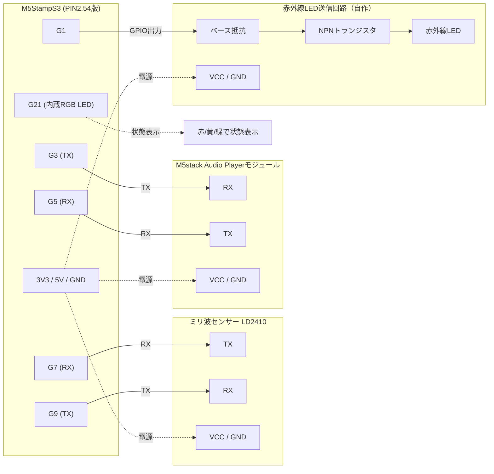

# タイトル

## 使用端末
1. M5StampS3（LCD・物理ボタンなし。RGB LED内蔵）
1. ミリ波センサー LD2410
1. M5stack Audio Playerモジュール
1. 赤外線LED送信回路（自作：赤外線LED＋トランジスタ。M5stack IR REMOTEモジュールは使用しない）

## ハードウェア接続
本体：M5StampS3
LCD：搭載しないため使用しない
本体スピーカー：使用しない（オフ）
状態表示：M5StampS3内蔵RGB LED（G21固定・本体標準機能のため変更不可）で代替
M5StampS3（TX=G9/RX=G7、左列） ⇒ ミリ波センサー LD2410（UART接続）
M5StampS3（TX=G3/RX=G5、左列上部） ⇒ M5stack Audio Playerモジュール（UART接続）
M5StampS3（G1、送信専用） ⇒ 赤外線LED送信回路
　赤外線LED送信回路：赤外線LED＋NPNトランジスタの自作回路（トランジスタでLED電流を増幅駆動する）。赤外線受信は使用しない
　G1からベース抵抗を介してトランジスタのベースを駆動し、コレクタ側でIR LEDを点灯させる構成とする（RMT等でのIR送信に対応するためGPIO直接駆動）
各モジュールの電源：StampS3ヘッダ上の3V3（右列上部）／5V（左列下部）／GND（左列・右列に各1箇所）から、モジュールの動作電圧仕様に応じて供給する
制御方法：別途立ち上げるWebサーバーのAPI経由で操作する

### ピン選定の理由（M5StampS3 PIN2.54版の実機ラベルで実配置を確認済み）
M5StampS3 PIN2.54版（2.54mmピッチ・スルーホール9P×2列＋前面6P）のヘッダ配置は以下の通り
・左列9P（上から下）：G1, G3, G5, G7, G9, GND, 5V, G13(SDA), G15(SCL)
・右列9P（上から下）：3V3, G43(U0Tx), G44(U0Rx), EN, G0, …, GND（G21はRGB LED専用、ヘッダには汎用ピンとして出ていない）
・前面6P：LCD/Ext.用の予備ピン（本プロジェクトでは未使用）
1.27mmピッチ23ピン版と異なり、2.54mmピッチ版の左列は奇数番号のGPIO（G1, G3, G5, G7, G9）のみが露出しており、G2/G4/G6/G8は使用不可
G0は本体ボタン兼ダウンロードモード切替ピンのため未使用（出力用途では誤動作の恐れがあるため避ける）
G21は内蔵RGB LEDの固定ピンのため他用途では使用しない
G19/G20はUSBネイティブ（D+/D-）専用のためヘッダに出ておらず使用不可
**G43(U0Tx)/G44(U0Rx)は使用しない**：シルク印刷上は「UART」表記だが、実機検証の結果、この2ピンはESP-IDFのシステムコンソールUART(UART0)がデフォルトで固定的に使用しており(ビルド設定 `CONFIG_ESP_CONSOLE_UART_NUM=0`)、Arduino側の`Serial`をUSB CDCへ切り替えても競合が解消されず、ジャンパ線での直結ループバックすら成立しなかった（詳細は実装時の動作確認で判明）。そのため当初の想定を変更し、LD2410は残りの奇数GPIOであるG7/G9に割り当てた
上記を踏まえ、露出している奇数GPIOのうちG1を赤外線LED送信用GPIO、G3/G5をAudio Playerモジュール、G7/G9をLD2410に割り当てた

### 配線図

## 画面
LCD非搭載のため画面表示は行わない
状態（入室/滞在/退室）に応じた表示はM5StampS3内蔵RGB LEDの色で代替する（対応する色は「遷移時の処理」参照）

## 操作
本体ボタン(G0)：押下でトイレ流し(赤外線送信)を手動実行する
設定パラメータの調整は物理ボタンでは行わず、別途立ち上げるWebサーバーのAPI経由で操作する（API仕様は別途定義。本仕様書では対象外）

## 設定パラメータ
API経由で調整できるパラメータは以下の3つ
・感度（sensitivity）：0〜100（10刻み）　※初期値はコード内定数
・ゲート（maxGate）：1〜8（1刻み）　※初期値はコード内定数
・滞在継続時間（入室状態→滞在状態の継続時間）：5〜60秒（5刻み）　※初期値20秒
値の変更はAPI経由で即座にセンサー・状態判定へ反映される（ライブ調整）
API経由の確定操作をトリガーに3項目まとめてNVS（不揮発メモリ）に保存する
起動時はNVSに保存された値があれば読み込み、なければ上記初期値を使用する

## シリアルモニタ
各状態を出力

## 実現したいこと
ミリ波センサー（LD2410）でトイレに人がいるかを判定したい
入室と退室で処理を分ける

## 人検知ロジック
距離の閾値判定は行わず、LD2410センサーが持つ「人がいるか（presence detected）」の判定結果をそのまま使用する
感度（sensitivity）・検知最大距離（ゲート数）は初期値をコード内定数として持ち、設定パラメータ（「設定パラメータ」参照）からAPI経由で実行中に調整・NVS保存が可能
・感度：0〜100（値が大きいほど検知しやすい）
・ゲート：1〜8（1ゲート＝0.75m、検知したい最大距離に応じて設定）
センサーの使い方は下記を参考にする
C:\Users\s\OneDrive\ドキュメント\PlatformIO\Projects\miriha\src\main.cpp

## 音声再生ロジック
M5stack Audio Playerモジュールのみを使用する（本体スピーカーはオフ）
M5stack Audio PlayerモジュールにあるSDカード内の音声ファイル(mori.mp3)を使用する
常に再生する（再生開始と停止は音量で表現する）
ファイルの最後まで再生したらまた最初から再生を開始する
再生開始・停止は音量でフェードする（フェード時間2000ms）

## 赤外線送信ロジック
M5stack IR REMOTEモジュールは使用せず、赤外線LED＋トランジスタによる自作回路をGPIO（送信専用）で駆動してIR送信を行う
送信するRAWデータは既存のものをそのまま使用する

#### トイレ流し
static const uint16_t kIrRawData[] = {5930, 2964, 568, 578, 542, 1700, 542, 554, 566, 554, 566, 552, 566, 552, 540, 576, 542, 576, 542, 576,540, 550, 564, 550, 564, 1672, 568, 552, 542, 576, 542, 576, 542, 576, 540, 550, 566, 550, 564, 552, 566, 550, 538, 576, 540, 574, 540, 576,540, 1668, 566, 552, 566, 1672, 542, 1700, 544, 578, 542, 1676, 568, 1678, 544, 580, 542, 1702, 544, 580, 542, 1676, 568, 1678, 542, 580, 542, 1702, 544, 1678, 568, 554, 568, 32920, 5932, 2964, 570, 578, 542, 1674, 568, 554, 568, 552, 566, 552, 566, 550, 540, 576, 542, 578, 540, 576, 540, 550, 564, 552, 564, 1670, 540, 578, 542, 576, 542, 578, 540, 576, 540, 552, 564, 550, 566, 550, 564, 550, 538, 574, 540, 574, 542, 574, 540, 1670, 566, 552, 566, 1672, 542, 1702, 542, 580, 542, 1676, 568, 1678, 542, 580, 542, 1702, 544, 552, 568, 1676, 568, 1678, 542, 580,542, 1702, 544, 1678, 568, 554, 568};
static const uint16_t kIrRawLen = 163;

### 入室状態の定義
人がいると判定されたら

### 滞在状態の定義
入室状態が20秒継続されていたら

### 退室状態の定義
人がいないと判定されたら

## 遷移時の処理

### 退室状態 ⇒ 入室状態
状態表示LED：赤
音声再生

### 入室状態 ⇒ 滞在状態
状態表示LED：黄
トイレ流し必要フラグをTURE

### 滞在状態 ⇒ 退室状態
状態表示LED：緑

音声停止
トイレ流し必要フラグがTUREならトイレ流し
フラグリセット

### 入室状態 ⇒ 退室状態
状態表示LED：緑

音声停止

## Home Assistant連携(MQTT)
人感センサーの状態(smoothedPresence)をWiFi+MQTT経由でHome Assistantへ通知する
起動時にWiFi接続、MQTTブローカーへ接続する(タイムアウト・再接続あり。未接続でも本体機能は継続動作する)
MQTTブローカー接続時、Home Assistant MQTT Discoveryのconfigペイロードを送信し、binary_sensor(device_class: occupancy)として自動登録させる
smoothedPresenceが変化した瞬間にstateトピックへON/OFFをpublish(retain)する
availabilityトピック(LWT)で本体のオンライン/オフラインをHome Assistant側に反映する
WiFi SSID/パスワード、MQTTブローカーのIP等はsrc/main.cpp冒頭の定数を書き換えて設定する(環境依存のため未コミット運用)
